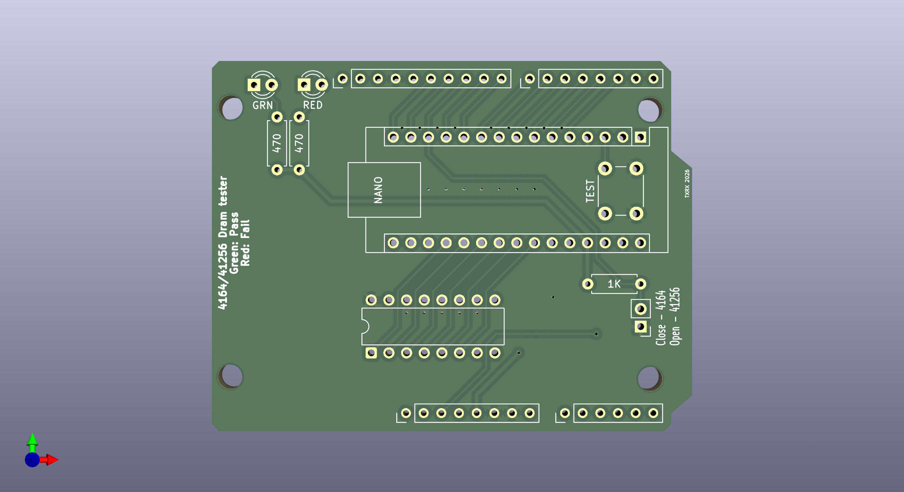

# Arduino Shield DRAM 4164 & 41256 Uno/Nano Tester
 
Arduno based tester for 4164/4264 (64k x 1bit) & 41256 (256k x 1bit) DRAM 
PCB based on ISS DRAMArduino schematic. 
https://forum.defence-force.org/viewtopic.php?t=1699  
Shield suitable for Arduino UNO or Arduino Nano.
 

    

 
Final Revision of my PCB design 
All parts clearly marked on PCB silkscreen. 

I'd recommend the Extended code and view the serial output to see what faults are found if any. 
Based on kinetix Extended DRAMArduino code 
https://www.vogons.org/viewtopic.php?t=107370
